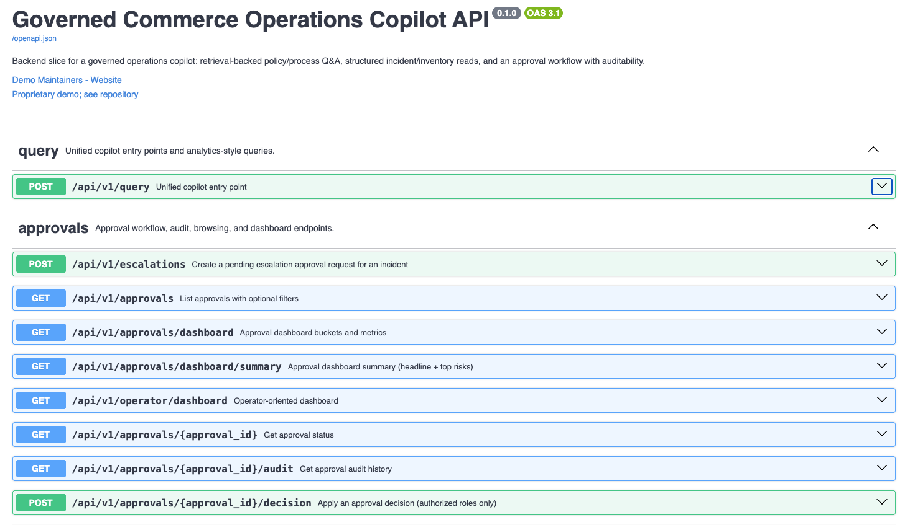
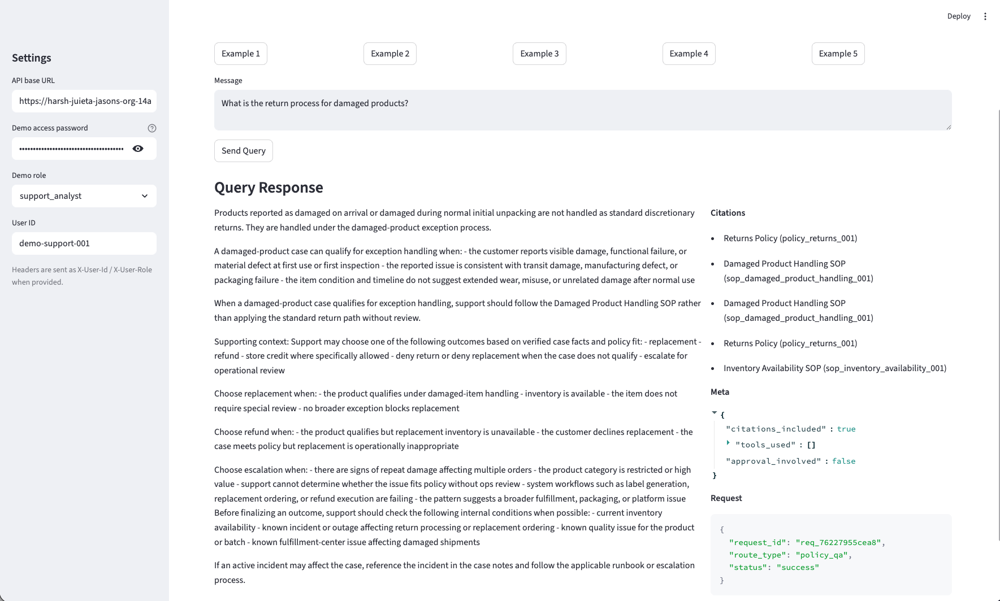

# CommerceOpsCopilot

Governed Commerce Operations Copilot is a live, password-protected hosted demo of an enterprise support copilot that combines:

- retrieval-backed policy and SOP guidance
- structured incident and inventory lookups
- approval-gated escalation workflows
- auditability and hosted smoke verification

Review this project in under 2 minutes:

- status:
  - ci:
    - `CI workflow configured`
  - hosted smoke:
    - `GitHub Actions workflow configured`
  - hosted demo:
    - live
  - last hosted smoke:
    - passed on `2026-04-28`
  - release:
    - `v0.1.0`
  - auth:
    - password-protected
  - data:
    - seeded / demo-only
  - deployment target:
    - Koyeb
- live hosted demo:
  - `https://harsh-juieta-jasons-org-14a2695f.koyeb.app/`
- what is hosted:
  - FastAPI API only
  - interactive docs at `/docs`
  - build metadata at `/version`
- click first:
  - `/`
  - `/docs`
- best screenshots:
  - `docs/screenshots/openapi-overview.png`
  - `docs/screenshots/approval-flow.png`
- best reviewer flow:
  - read the root landing page
  - open `/docs`
  - run one `POST /api/v1/query`
  - run one approval flow
- hosted auth:
  - Basic auth username: `demo`
  - password shared out-of-band by the maintainer
- how access works:
  - the repo explains the access model
  - the password value is never committed
  - reviewers receive access directly from the maintainer
- how to request demo access:
  - contact the maintainer
  - receive the shared password out-of-band
  - use the repo-hosted URL plus the maintainer-shared password
- review kit:
  - `docs/review-kit.md`
- local reviewer UI:
  - `make ui`
- real vs demo-only:
  - real backend, real embeddings, real hosted deploy
  - demo auth, seeded data, and demo-safe approval workflow

For deployment hardening guidance, see [`SECURITY.md`](SECURITY.md).

For the hosted release runbook, see [`docs/release-checklist.md`](docs/release-checklist.md).

For the hosted-demo milestone note, see [`docs/releases/hosted-demo-v1.md`](docs/releases/hosted-demo-v1.md).

For the reviewer handoff doc, see [`docs/review-kit.md`](docs/review-kit.md).

For terminal-first review assets, see:

- [`docs/api-review/README.md`](docs/api-review/README.md)
- [`docs/api-review/curl-examples.md`](docs/api-review/curl-examples.md)

For all published releases, see:

- `https://github.com/jasonpierson/commerce-copilot/releases`

Governed Commerce Operations Copilot is a Python/FastAPI prototype for a support-facing copilot that blends:

- retrieval over a curated operations corpus
- structured lookups over operational tables
- approval-gated escalation workflows
- lightweight operational analytics over approval load

The project started as an ingestion/retrieval scaffold and has grown into a working backend slice for policy Q&A, incident support, inventory lookup, and approval workflow operations.

## Visual Tour

### Hosted API overview


### Interactive query example


### Local Streamlit reviewer UI


## Governed Approval Flow

The key differentiator in this project is that escalation is governed, not just suggested.

Flow:

1. create an escalation request
2. retrieve approval status
3. submit an approval decision
4. trace the request and approval events

Approval flow example:


## How Demo Access Works

- the hosted API is private-by-password for reviewers
- the password is shared out-of-band by the maintainer
- the repo never contains the password value
- the clean hosted review path is:
  - `/`
  - `/docs`
  - `/version`
- for curl or debugging:
  - capture the `X-Request-Id` response header
  - correlate it with hosted logs or local trace inspection

## 2-Minute Demo

```bash
make install
make seed
make run-api
```

In a second shell:

```bash
make demo
```

Optional demo UI (Streamlit):

```bash
make ui
```

Then open the Streamlit URL (typically http://localhost:8501) and try:
- policy/process Q&A
- inventory lookup
- incident summary
- approval request/status/decision

What the demo shows:
- policy/process Q&A with citations
- inventory lookup against structured data
- incident summary with retrieval + structured context
- escalation guidance
- approval request, status, decision, and audit trail

## Try It From Terminal

Set reusable shell vars first:

```bash
export HOSTED_URL="https://harsh-juieta-jasons-org-14a2695f.koyeb.app"
export DEMO_PASSWORD="<DEMO_PASSWORD>"
```

Check the deployed build:

```bash
curl -u "demo:${DEMO_PASSWORD}" \
  "${HOSTED_URL}/version"
```

Ask a policy question:

```bash
curl -u "demo:${DEMO_PASSWORD}" \
  -H "Content-Type: application/json" \
  -H "X-User-Id: demo-support-001" \
  -H "X-User-Role: support_analyst" \
  -d '{"message":"What is the return process for damaged products?"}' \
  "${HOSTED_URL}/api/v1/query"
```

Run an inventory lookup:

```bash
curl -u "demo:${DEMO_PASSWORD}" \
  -H "Content-Type: application/json" \
  -H "X-User-Id: demo-support-001" \
  -H "X-User-Role: support_analyst" \
  -d '{"message":"Check inventory for the Phantom X shoes."}' \
  "${HOSTED_URL}/api/v1/query"
```

Create an escalation request:

```bash
curl -u "demo:${DEMO_PASSWORD}" \
  -H "Content-Type: application/json" \
  -H "X-User-Id: demo-support-001" \
  -H "X-User-Role: support_analyst" \
  -d '{"incident_code":"INC-1091","escalation_reason":"Reviewer demo escalation.","proposed_priority":"critical","draft_summary":"Disposable reviewer approval request."}' \
  "${HOSTED_URL}/api/v1/escalations"
```

Use `X-Request-Id` from the response headers to correlate hosted logs.

## Reviewer Path

- 1:
  - open the hosted URL
- 2:
  - check `/version` to confirm the deployed build
- 3:
  - open `/docs`
- 4:
  - authenticate with the maintainer-shared password
- 5:
  - run one policy query and one approval flow

## Hosting Position

- authoritative hosted surface:
  - FastAPI API on Koyeb using the repo `Dockerfile`
- deployment config file:
  - `koyeb.yaml`
- Streamlit:
  - local-only reviewer helper
  - not part of the hosted deployment path
- reviewer options:
  - use `/docs` on the hosted API
  - or run `make ui` locally against the hosted API
- current hosted demo URL:
  - `https://harsh-juieta-jasons-org-14a2695f.koyeb.app/`
- hosted review auth:
  - Basic auth username: `demo`
  - password shared out-of-band by the maintainer
- release/build verification:
  - `GET /version`
- hosted regression check:
  - `.github/workflows/hosted-smoke.yml`
  - publishes a human-readable summary and JSON artifact in GitHub Actions

## Current Status

### Implemented
- Retrieval-backed `policy_qa`, `incident_summary`, and `escalation_guidance`
- Structured inventory lookup from seeded `products`, `inventory`, and `locations`
- Incident detail and incident timeline endpoints
- Approval request, status, decision, audit, list, and dashboard endpoints
- `/api/v1/query` support for:
  - policy/process questions
  - incident summaries
  - escalation guidance
  - approval status/history/rejection reason questions
  - approval browsing and dashboard questions
  - pending-approval owner questions
- requester-load questions
- escalation-load / approval-pressure questions
- Demo seeding and cleanup scripts for local/live development
- API test coverage for the main approval, inventory, and incident flows

### Not Implemented Yet
- production operator frontend
- production authentication/authorization beyond explicit mock auth headers
- production-grade approval notifications or workflow orchestration
- incident/approval analytics beyond the current dashboard metrics
- full production deployment packaging and infra automation

## What Makes This Enterprise-Focused

- grounded answers
  - retrieval-backed responses include citations to policies, SOPs, and runbooks
- governed actions
  - incident escalation is approval-gated instead of directly executed
- role-aware behavior
  - mock auth headers make principal boundaries explicit during demos
- operational inspectability
  - request traces persist to JSONL artifacts so flows can be audited after the session
- mixed-mode architecture
  - retrieval is used where narrative guidance is needed
  - structured data is used where exact operational state matters

## Implementation Boundary

### Real / Implemented
- FastAPI API layer
- real OpenAI embeddings for ingestion and retrieval
- real structured reads/writes against the connected demo database
- persistent JSONL request tracing
- response-level `X-Request-Id` headers on core API routes
- seeded approval, inventory, and incident demo paths

### Mock / Demo-Only
- auth via `X-User-Id` and `X-User-Role`
- password gate via `DEMO_ACCESS_PASSWORD`
- disposable seeded operational data
- approval workflow used as a demo-safe governance simulation

### Future Work
- production auth
- notificationing / escalation orchestration
- frontend operator console
- containerized deployment path with managed infra assumptions

## Architecture

See also:
- [`docs/architecture.md`](docs/architecture.md)
- [`docs/deployment.md`](docs/deployment.md)

```text
app/
  api/
    main.py                FastAPI app assembly
    query_router.py        /api/v1/query entrypoint
    query_service.py       Route classification and response orchestration
    incident_router.py     Incident detail endpoint
    incident_service.py    Incident DB access
    inventory_service.py   Product + inventory DB access
    approval_router.py     Approval workflow endpoints
    approval_service.py    Approval + audit DB access
    db.py                  Shared Postgres connection helpers
    schemas.py             Pydantic response/request models

  retrieval/
    runtime.py             Retrieval service wiring
    service.py             Retrieval orchestration
    scorer.py              Post-retrieval scoring/reranking
    repository.py          Vector retrieval repository
    config.py              Retrieval tuning from env
    evals/                 Retrieval evaluation set + evaluator

  ingestion/
    runner.py              Ingestion entrypoint
    loader.py              Corpus loading
    normalizer.py          Text normalization
    chunker.py             Chunk creation
    segmenter.py           Segmentation helpers
    embedder.py            Ingestion embeddings
    repository.py          Ingestion persistence
    report.py              Ingestion reporting

  common/
    config.py              Shared embedding config
    embeddings.py          OpenAI embedder

scripts/
  run_api.py               Starts FastAPI app
  run_ingestion.py         Runs ingestion pipeline
  run_retrieval_eval.py    Runs retrieval evaluation
  run_retrieval_smoke_test.py
  seed_domain_data.py      Seeds demo users/catalog/incidents
  cleanup_demo_data.py     Cleans demo data or approval-only artifacts
ui/
  app.py                   Minimal Streamlit UI for demoing the API
```

## Fast Local Run Path

### Make-based starter path

```bash
make install
make seed
make run-api
```

Useful commands:
- `make test`
- `make test-api`
- `make eval`
- `make smoke`
- `make smoke-remote`
- `make smoke-remote-live`
- `make verify-hosted-contract`
- `make verify-env`
- `make demo`
- `make ui`
- `make inspect-logs`
- `make clean-approvals`
- `make clean-full`

## Core Concepts

### 1. Retrieval Layer
The retrieval subsystem answers policy/process questions and supports incident/escalation guidance.

Key properties:
- vector search against Postgres-backed retrieval data
- route-aware post-retrieval scoring
- per-route chunk caps for precision/diversity balance
- evaluation harness with a JSONL eval set and adapter mode

Primary files:
- `app/retrieval/runtime.py`
- `app/retrieval/service.py`
- `app/retrieval/scorer.py`
- `app/retrieval/evals/evaluator.py`
- `scripts/run_retrieval_eval.py`

Canonical evaluator path:
- `app/retrieval/evals/evaluator.py`
- `scripts/run_retrieval_eval.py`

### 2. Structured Operational Data
The API uses structured tables for live answers where retrieval alone is not enough.

Current structured domains:
- inventory and catalog
- incidents and incident timelines
- approvals and approval audit history
- demo users/approvers

Primary files:
- `app/api/inventory_service.py`
- `app/api/incident_service.py`
- `app/api/approval_service.py`
- `scripts/seed_domain_data.py`

### 3. `/api/v1/query` as the Main Copilot Entry Point
`/api/v1/query` classifies the user message into a route and then composes retrieval, structured data, links, and approval suggestions into one response.

Representative route types:
- `policy_qa`
- `structured_lookup`
- `incident_summary`
- `escalation_guidance`

Primary files:
- `app/api/query_router.py`
- `app/api/query_service.py`

Shared response shape:
- `request_id`
- `status`
- `route_type`
- `data.answer`
- `data.citations` for retrieval-backed answers
- `meta.tools_used`
- `meta.approval_involved`

## API Surface

### Health
- `GET /health`
- `GET /ready`

### Unified Query
- `POST /api/v1/query` — see interactive docs at `/docs`

### Incident Endpoints
- `GET /api/v1/incidents/{incident_code}`

### Approval Endpoints
- `POST /api/v1/escalations`
- `GET /api/v1/approvals`
- `GET /api/v1/approvals/dashboard`
- `GET /api/v1/approvals/{approval_id}`
- `GET /api/v1/approvals/{approval_id}/audit`
- `POST /api/v1/approvals/{approval_id}/decision`

### Mock Auth for Demos
This repo now uses explicit mock/demo auth headers for user context and approval decisions:
- `X-User-Id`
- `X-User-Role`
- `Authorization: Basic demo:<DEMO_ACCESS_PASSWORD>` or `X-Demo-Password`

What this does:
- keeps the project demo-friendly
- makes approval role boundaries explicit in code
- lets us show governance behavior without pretending this is production auth

Current behavior:
- query and approval routes accept the headers above
- approval decisions only succeed for `ops_manager` or `admin`
- if headers are present, they override any fallback role/user fields in the JSON body
- if `DEMO_ACCESS_PASSWORD` is set, all non-`/health` routes require the demo password
- `/docs` stays usable for reviewers because the API accepts Basic auth
- `/ready` stays public so the host can verify deployment readiness

### Hosted Review Path
Use this flow when reviewing a deployed demo:
- open `https://harsh-juieta-jasons-org-14a2695f.koyeb.app/`
- confirm the landing page explains:
  - what the app is
  - where to go next
  - that Streamlit is local-only
- open `/docs`
- authenticate with:
  - Basic auth user: `demo`
  - password: `DEMO_ACCESS_PASSWORD`
- try these 4 flows:
  - policy/process query
  - inventory lookup
  - incident summary
  - create + inspect one approval

## Example Query Behaviors

### Policy / Process
```bash
curl -s http://127.0.0.1:8000/api/v1/query \
  -H 'Content-Type: application/json' \
  -d '{
    "message": "What is the return process for damaged products?",
    "user_role": "support_analyst"
  }'
```

```json
{
  "route_type": "policy_qa",
  "data": {
    "answer": "...policy answer...",
    "citations": [
      {
        "doc_key": "policy_returns_001",
        "title": "Returns Policy"
      }
    ]
  }
}
```

### Inventory Lookup
```bash
curl -s http://127.0.0.1:8000/api/v1/query \
  -H 'Content-Type: application/json' \
  -d '{
    "message": "Check inventory for the Phantom X shoes.",
    "user_role": "support_analyst"
  }'
```

```json
{
  "route_type": "structured_lookup",
  "data": {
    "answer": "...inventory answer...",
    "product": {
      "product_name": "Phantom X Shoes"
    },
    "inventory_results": [
      {
        "location_code": "CHI-01",
        "quantity_available": 12
      }
    ]
  }
}
```

### Incident Summary
```bash
curl -s http://127.0.0.1:8000/api/v1/query \
  -H 'Content-Type: application/json' \
  -d '{
    "message": "Summarize incident INC-1091 and tell me the likely customer impact.",
    "user_role": "engineering_support"
  }'
```

```json
{
  "route_type": "incident_summary",
  "data": {
    "answer": "...incident summary...",
    "incident": {
      "incident_code": "INC-1091"
    },
    "citations": [
      {
        "doc_key": "incident_playbook_mobile_checkout_001",
        "title": "Mobile Checkout Incident Playbook"
      }
    ]
  }
}
```

### Escalation Guidance
```bash
curl -s http://127.0.0.1:8000/api/v1/query \
  -H 'Content-Type: application/json' \
  -d '{
    "message": "Should INC-1091 be escalated right now?",
    "user_role": "ops_manager"
  }'
```

```json
{
  "route_type": "escalation_guidance",
  "data": {
    "answer": "...escalation guidance...",
    "approval_suggestion": {
      "action_type": "incident_escalation",
      "incident_code": "INC-1091",
      "proposed_priority": "critical"
    },
    "citations": [
      {
        "doc_key": "matrix_priority_escalation_001",
        "title": "Priority Escalation Matrix"
      }
    ]
  }
}
```

### Approval History
```text
Why was approval <approval_id> rejected?
Show me the approval history for incident INC-1091.
```

### Approval Operations
```text
Show me all pending approvals.
Show me rejected approvals for INC-1091.
Show me the approval dashboard.
Who is holding the pending approvals for INC-1091?
Which requester has the oldest pending approval?
Which incident has the oldest pending approval?
Which approver has the oldest pending item?
Which approver is the bottleneck?
Which requester is creating the most approval load?
Which incidents have the most pending approval pressure?
Show me only incidents with pending approvals older than 30 minutes.
```

## Operator Analytics

Use these prompts when you want a quick operational read on approval load without going straight to raw endpoints.

```text
Show me the approval dashboard.
Which requester has the oldest pending approval?
Which incident has the oldest pending approval?
Which approver has the oldest pending item?
Which approver is the bottleneck?
Which requester is creating the most approval load?
Which incidents have the most pending approval pressure?
Show me only incidents with pending approvals older than 30 minutes.
```

Useful operator endpoints:
- `GET /api/v1/approvals/dashboard`
- `GET /api/v1/approvals/dashboard/summary`
- `GET /api/v1/operator/dashboard`

## Dashboard Metrics

`GET /api/v1/approvals/dashboard` and dashboard-style `/api/v1/query` responses currently expose:

- `pending_count`
- `oldest_pending_age_minutes`
- `pending_by_priority`
- `pending_by_owner`
- `pending_by_incident`
- `approvals_created_last_24h`
- `approvals_decided_last_24h`
- `approvals_created_last_7d`
- `approvals_decided_last_7d`
- `daily_trends_7d`
- `oldest_pending_item`

Supported dashboard filters:
- `incident_code`
- `requester`
- `page_size_per_bucket`

Dashboard summary endpoint:
- `GET /api/v1/approvals/dashboard/summary`
- optional filters:
  - `incident_code`
  - `requester`
  - `min_pending_age_minutes`

Operator dashboard endpoint for future UI work:
- `GET /api/v1/operator/dashboard`
- returns:
  - headline summary text
  - top risks first
  - grouped approval buckets
  - links to the approval dashboard APIs

## Local Setup

### Requirements
- Python 3.11+
- Postgres/Supabase database with the expected schema
- OpenAI API key for real embeddings/query embedding

Database model:
- application tables now live in `app_private`
- the FastAPI backend owns database access for those tables
- browser/client code does not talk directly to the Supabase Data API for app tables
- RLS is intentionally not added yet because the exposure path is backend-only

### Install
```bash
python3 -m venv .venv
source .venv/bin/activate
python -m pip install -U pip
python -m pip install -e .
```

### Optional: Docker-based startup

```bash
docker build -t commerce-ops-copilot .
docker run --rm -p 8000:8000 --env-file .env.local commerce-ops-copilot
```

Or with compose:

```bash
docker compose up --build
```

### Environment
Create `.env.local` in the repo root and keep it out of git.

Typical variables:

```bash
OPENAI_API_KEY=...
SUPABASE_DB_URL=...
DEMO_ACCESS_PASSWORD=...
APP_ENV=development
APP_HOST=127.0.0.1
APP_PORT=8000
GCOP_API_BASE=http://127.0.0.1:8000
EMBEDDING_PROVIDER=openai
EMBEDDING_MODEL=text-embedding-3-small
EMBEDDING_DIMENSIONS=1536
DB_APP_SCHEMA=app_private
```

Notes:
- ingestion and retrieval both use the same real embedding config
- default embedding model is `text-embedding-3-small`
- default embedding dimension is `1536`
- `EMBEDDING_PROVIDER` must stay `openai` for ingestion and live retrieval
- `DB_APP_SCHEMA` defaults to `app_private`
- `DEMO_ACCESS_PASSWORD` enables the demo password gate for API and UI access
- `APP_ENV`, `APP_HOST`, and `APP_PORT` drive the API startup mode and bind settings
- `PORT` is honored when the host injects it (for example on Koyeb)
- `GCOP_API_BASE` points the local Streamlit UI at the API you want to demo

Password rotation:
- update `DEMO_ACCESS_PASSWORD`
- restart or redeploy the API
- update the Streamlit password field or your local env if you use the UI

Retrieval tuning is env-driven as well; the retrieval config reads several runtime knobs from environment variables.

## Common Workflows

### Run the API
```bash
source .venv/bin/activate
set -a
source .env.local
set +a
python scripts/run_api.py
```

Production-lite local bind:

```bash
source .venv/bin/activate
set -a
source .env.local
set +a
APP_ENV=production APP_HOST=0.0.0.0 APP_PORT=8000 python scripts/run_api.py
```

Readiness semantics:
- `/health`
  - shallow liveness check
- `/ready`
  - required config is present
  - DB connectivity succeeds

### Run Ingestion
```bash
source .venv/bin/activate
set -a
source .env.local
set +a
python -m app.ingestion.runner --corpus-root ./corpus
```

Re-ingest after changing embedding configuration or rebuilding the retrieval baseline so stored chunk vectors and live query vectors stay aligned.

### Run Retrieval Eval
```bash
source .venv/bin/activate
set -a
source .env.local
set +a
python scripts/run_retrieval_eval.py --mode adapter
```

### Check Backend DB Schema Access
```bash
source .venv/bin/activate
set -a
source .env.local
set +a
python scripts/check_db_schema.py
```

Or with `make`:

```bash
make check-db-schema
```

## Retrieval Quality

Current canonical baseline:
- `top_1_hit_rate`: `1.0`
- `top_3_hit_rate`: `1.0`
- `section_match_top_3_rate`: `0.8667`
- `retrieval_boundary_correct_rate`: `1.0`
- `unexpected_noise_top_3_rate`: `0.0`

How to rebuild the baseline:
```bash
source .venv/bin/activate
set -a
source .env.local
set +a
python -m app.ingestion.runner --corpus-root ./corpus
python3 scripts/run_retrieval_eval.py --mode adapter
```

Reference:
- `docs/retrieval-updates.md`
- `artifacts/retrieval_eval_report.json`

### Seed Demo Operational Data
```bash
source .venv/bin/activate
set -a
source .env.local
set +a
python scripts/seed_domain_data.py
```

### Cleanup Demo Approval Artifacts Only
```bash
source .venv/bin/activate
set -a
source .env.local
set +a
python -m scripts.cleanup_demo_data --scope approvals --apply
```

### Cleanup Full Demo Operational Data
```bash
source .venv/bin/activate
set -a
source .env.local
set +a
python -m scripts.cleanup_demo_data --scope full --apply
```

### Run the Golden-Path Demo
```bash
source .venv/bin/activate
set -a
source .env.local
set +a
python scripts/demo_queries.py
```

This scripted demo covers:
- policy question
- inventory lookup
- incident summary
- escalation guidance
- escalation request
- approval status
- approval decision
- approval audit/history

### Approval Workflow Demo
```bash
# 1. create an escalation approval request
curl -s http://127.0.0.1:8000/api/v1/escalations \
  -H 'Content-Type: application/json' \
  -H 'X-User-Id: demo-support-001' \
  -H 'X-User-Role: support_analyst' \
  -d '{
    "incident_code": "INC-1091",
    "escalation_reason": "Customer impact remains elevated.",
    "proposed_priority": "critical",
    "draft_summary": "Escalate to management due to ongoing checkout failures."
  }'

# 2. check approval status
curl -s http://127.0.0.1:8000/api/v1/approvals/<approval_id>

# 3. approve or reject the request
curl -s http://127.0.0.1:8000/api/v1/approvals/<approval_id>/decision \
  -H 'Content-Type: application/json' \
  -H 'X-User-Id: demo-ops-manager-001' \
  -H 'X-User-Role: ops_manager' \
  -d '{
    "decision": "approved",
    "decision_notes": "Approved for incident coordination."
  }'

# 4. inspect audit history
curl -s http://127.0.0.1:8000/api/v1/approvals/<approval_id>/audit
```

Expected sequence:
- create request
- check status
- decide approval
- inspect audit/history

### Persistent Event Logs

Structured JSONL logs are persisted to:
- `artifacts/retrieval_events.jsonl`
- `artifacts/query_events.jsonl`
- `artifacts/approval_events.jsonl`

What we log:
- `request_id`
- `route_type`
- `user_role`
- `doc_keys` for retrieval-backed answers
- `tools_used`
- `approval_id` / `approval_ids` when approval state is involved

Typical ways to create the logs:
- `python3 scripts/run_retrieval_eval.py --mode adapter`
- `POST /api/v1/query`
- `POST /api/v1/escalations`
- `POST /api/v1/approvals/{approval_id}/decision`

Quick trace flow:
1. run a query or approval workflow call
2. copy the returned `request_id`
3. search the artifacts:

```bash
rg "req_" artifacts/*.jsonl
rg "<request_id>" artifacts/*.jsonl
```

Or use the helper script:

```bash
python scripts/inspect_logs.py --tail 50
python scripts/inspect_logs.py --request-id <req_id>
python scripts/inspect_logs.py --approval-id <apr_id>
```

Or use the make target:

```bash
make inspect-logs
```

## Future Public Deployment Security Notes

If you later deploy this API publicly, add a minimum security envelope before exposing it on the internet.

### Recommended baseline
- require authentication on all non-health endpoints
- put the API behind a reverse proxy or gateway with request throttling
- apply per-user or per-token rate limits on `/api/v1/query` and approval endpoints
- disable broad anonymous access to operational and approval data
- add structured request logging and alerting for bursts, abuse, and repeated failures
- rotate secrets and keep all runtime secrets out of the repo

### Practical first controls
- auth: API keys, OAuth, or signed internal service tokens
- rate limiting: per-IP and per-principal limits, especially for `/api/v1/query`
- network controls: allowlist internal callers where possible
- CORS: restrict origins if a browser-based client is introduced
- DB security: use least-privilege DB credentials and row-level protections where appropriate

### Current development posture
- this repo does not expose your `.env.local` when gitignore is respected
- a local-only FastAPI process is not reachable just because the repo is public
- the bigger risk begins when the API is deployed to a public hostname without auth or limits

### Current hosted-demo baseline
- demo password gate:
  - all non-`/health`
  - `/ready` remains public for platform health checks
- in-app rate limiting:
  - `POST /api/v1/query`
  - `POST /api/v1/escalations`
  - `POST /api/v1/approvals/{approval_id}/decision`
- persistent local artifact logs plus stdout JSON event logs for hosted platforms

## Operator Runbook

Use this section for common local and live-safe operator workflows while developing.

### 1. Start the API locally
```bash
source .venv/bin/activate
set -a
source .env.local
set +a
python scripts/run_api.py
```

### 1a. Launch the local demo UI
Keep Streamlit local and point it at the API you want to review.

```bash
source .venv/bin/activate
set -a
source .env.local
set +a
streamlit run ui/app.py
```

### 2. Seed the demo operational data
Use this when inventory, incidents, locations, or demo users are missing.

```bash
source .venv/bin/activate
set -a
source .env.local
set +a
python scripts/seed_domain_data.py
```

### 3. Smoke-test core query flows
Good quick checks:

```text
Check inventory for the Phantom X shoes.
Summarize incident INC-1091 and tell me the likely customer impact.
Show me the approval dashboard.
Who is holding the pending approvals for INC-1091?
Which requester is creating the most approval load?
Which incidents have the most pending approval pressure?
Which approver is the bottleneck?
```

### 3a. Inspect traces after a smoke test
```bash
source .venv/bin/activate
python scripts/inspect_logs.py --tail 50
```

### 3b. Smoke-test a hosted deployment
```bash
source .venv/bin/activate
set -a
source .env.local
set +a
python scripts/smoke_remote_demo.py
```

Recommended for the live Koyeb deployment:

```bash
make smoke-remote-live
```

### 3c. Verify env before deploy or password rotation
```bash
source .venv/bin/activate
set -a
source .env.local
set +a
python scripts/verify_env.py
```

### 4. Run the local test suite
```bash
source .venv/bin/activate
python -m unittest discover -s tests -p 'test_*.py' -v
```

### 5. Cleanup only approval smoke-test artifacts
Use this after disposable approval workflow tests so demo catalog/incident data remains intact.

```bash
source .venv/bin/activate
set -a
source .env.local
set +a
python -m scripts.cleanup_demo_data --scope approvals --apply
```

### 6. Cleanup the full demo dataset
Use this only when you want to reset seeded operational data entirely.

```bash
source .venv/bin/activate
set -a
source .env.local
set +a
python -m scripts.cleanup_demo_data --scope full --apply
```

### 7. Safe public-repo hygiene checklist
Before pushing:
- confirm `.env.local` is still ignored
- confirm no secrets were added to committed files
- prefer disposable demo approvals for smoke tests
- run approval-only cleanup after live approval smoke tests

## Testing

### Unit/API Tests
```bash
source .venv/bin/activate
python -m unittest discover -s tests -p 'test_*.py' -v
```

Current covered areas include:
- inventory lookups
- inventory/incident extraction helpers
- incident detail and incident summary flows
- escalation request/decision flows
- approval status/history/audit flows
- approval list/dashboard flows
- `/api/v1/query` approval operations behavior
- mock auth enforcement on approval decisions
- persistent query trace side effects

## Demo Seed Data

The project includes demo operational data for development and smoke testing.

Seeded domains:
- users
- products
- locations
- inventory rows
- incidents
- incident timeline events

Important seeded incident examples:
- `INC-1042` — resolved mobile checkout issue
- `INC-1077` — investigating inventory feed sync delay
- `INC-1091` — mitigated payment authorization timeout

Representative seeded product:
- `PX-100` / `Phantom X Shoes`

## Known Limitations / Next Steps

- This is still a scaffold/prototype, not a production-hardened service
- Database schema management is assumed rather than fully codified in this repo
- Query classification is rule-based and intentionally simple
- The app currently assumes trusted internal usage patterns and demo identities
- Retrieval quality depends on environment tuning and corpus quality
- Audit logging is best-effort in the scaffold
- Next natural expansions:
  - tighter analytics response formatting and richer operator views
  - production auth and notification plumbing
  - frontend/operator UI
  - containerized deployment path

## What Is Intentionally Demo-Only

- Mock auth via `X-User-Id` and `X-User-Role` instead of a real IdP
- Shared demo password gate instead of real user/session auth
- No frontend session management or CSRF/session protection
- Approval notifications/workflow orchestration are stubs
- Only lightweight in-memory rate limiting is enabled
- Minimal UI (Streamlit) meant only for quick demos

## What Would Change For Production

- Require auth on all non-health endpoints (API keys/OAuth/JWT)
- Replace the shared demo password with real identity + token validation
- Replace in-memory rate limiting with gateway/distributed enforcement
- Stronger authorization policies; optionally RLS for mixed-sensitivity data
- Managed secret storage; zero secrets in env files on hosts
- Production log handling with redaction, retention, and alerting
- Deployment packaging (Docker/infra as code) with CI/CD and rollout controls

## Files Worth Reading First

If you are new to the repo, start here:
- `README.md`
- `CHANGELOG.md`
- `docs/architecture.md`
- `docs/deployment.md`
- `docs/demo.md`
- `docs/release-checklist.md`
- `koyeb.yaml`
- `app/api/query_service.py`
- `app/api/approval_service.py`
- `app/retrieval/service.py`
- `scripts/seed_domain_data.py`
- `tests/test_api.py`

## Project Trajectory

The repo has evolved in roughly this order:

1. ingestion scaffold
2. retrieval evaluation and tuning
3. backend API slice for query/incident/inventory support
4. approval workflow and audit trail
5. approval browsing/dashboard operations layer

The next likely expansion areas are:
- richer cross-incident workload and approval-pressure analytics
- approval queue operations and ownership reporting
- better retrieval/structured orchestration
- UI and operator workflows on top of the API
