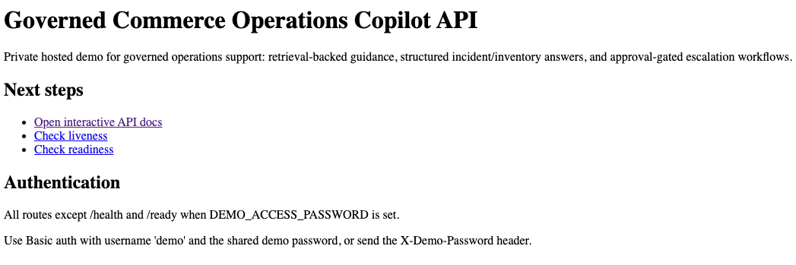
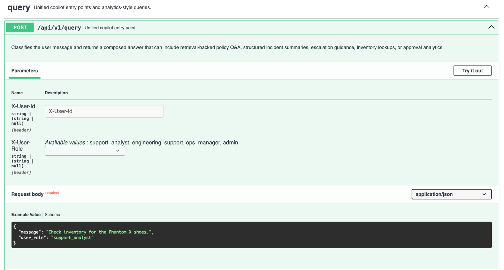
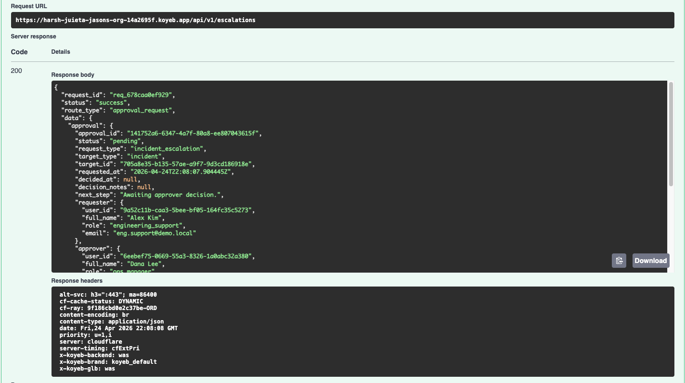

# Demo Walkthrough

## What This Project Demonstrates

- governed AI assistance
- retrieval + structured tools in one API
- approval-gated escalation workflows
- persistent audit and runtime traces
- a private hosted demo path instead of a toy local-only project

## Visual Walkthrough

### Hosted landing page


### OpenAPI query example


### Approval workflow response


## Fast Review Paths

### Path A — Hosted API review

1. Open the hosted base URL.
2. Confirm the landing page points you to:
   - `/docs`
   - `/health`
   - `/ready`
3. Open the hosted `/docs`.
4. Authenticate with:
   - username:
     - `demo`
   - password:
     - the shared `DEMO_ACCESS_PASSWORD`
5. Try these flows:
   - `POST /api/v1/query`
     - policy question
   - `POST /api/v1/query`
     - inventory lookup
   - `POST /api/v1/query`
     - incident summary
   - `POST /api/v1/escalations`
     - create approval
   - `GET /api/v1/approvals/{approval_id}`
   - `POST /api/v1/approvals/{approval_id}/decision`

## Live Hosted Validation Notes

- verified live on:
  - `2026-04-24`
- confirmed:
  - `/` returns `200`
  - `/docs` loads correctly behind the password gate
  - `/health` returns `200`
  - `/ready` returns `200`
  - the hosted smoke path succeeds end to end
- practical note:
  - the first hosted smoke run may need a longer timeout during cold start

## Manual Hosted Reviewer Pass

- completed on:
  - `2026-04-24`
- sequence validated:
  - root landing page
  - `/docs`
  - policy query
  - inventory lookup
  - incident summary
  - escalation request
  - approval status lookup
  - approval decision
  - request-id capture for log tracing
- representative request IDs from the reviewer pass:
  - policy:
    - `req_238703f6a455`
  - inventory:
    - `req_e4182b1e7f34`
  - incident:
    - `req_3c8caa8656f7`
  - approval create:
    - `req_af8b5f366715`
  - approval status:
    - `req_75c8b30d4294`
  - approval decision:
    - `req_8a9d820df29b`
- friction fixed during this pass:
  - root landing page now explicitly says Streamlit is local-only
  - hosted review docs now match the live URL and auth flow

### Path B — Local UI review

```bash
make install
make seed
make run-api
make ui
```

Or point the UI at a hosted API:

```bash
GCOP_API_BASE="https://harsh-juieta-jasons-org-14a2695f.koyeb.app/" make ui
```

## Password Gate Notes

- local FastAPI:
  - set `DEMO_ACCESS_PASSWORD` in `.env.local`
  - restart the API after changing it
- hosted FastAPI:
  - rotate the platform secret
  - redeploy or restart the app
- local Streamlit against hosted FastAPI:
  - update `.env.local` or the sidebar password field
  - reload the page after rotation

## Suggested Query Prompts

- `What is the return process for damaged products?`
- `Check inventory for the Phantom X shoes.`
- `Summarize incident INC-1091 and tell me the likely customer impact.`
- `Should INC-1091 be escalated right now?`
- `Show me the approval dashboard.`
- `Which approver is the bottleneck?`

## Architecture Decisions

- retrieval stays focused on narrative guidance:
  - policies
  - SOPs
  - runbooks
- structured reads answer exact operational state:
  - inventory
  - incidents
  - approvals
- escalation is governed:
  - suggested in query flows
  - executed only through approval endpoints
- hosted-demo safety is layered:
  - demo password gate
  - lightweight rate limiting
  - readiness checks
  - JSON stdout logging

## Known Limitations

- demo auth is not real production identity
- rate limiting is in-memory, not distributed
- Streamlit is a reviewer convenience layer, not the product frontend
- approval notifications and orchestration are still stubbed
- hosted smoke tests can create disposable approval records unless skipped
